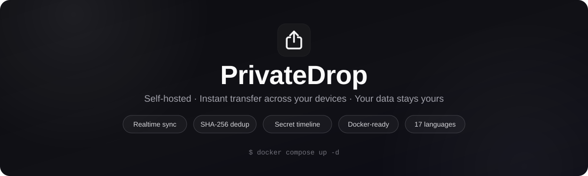
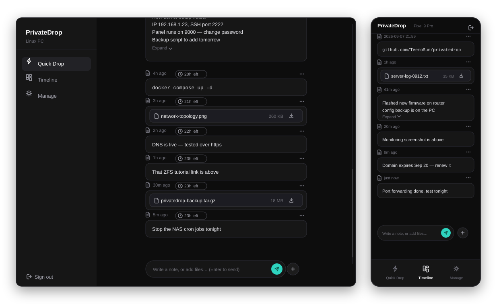
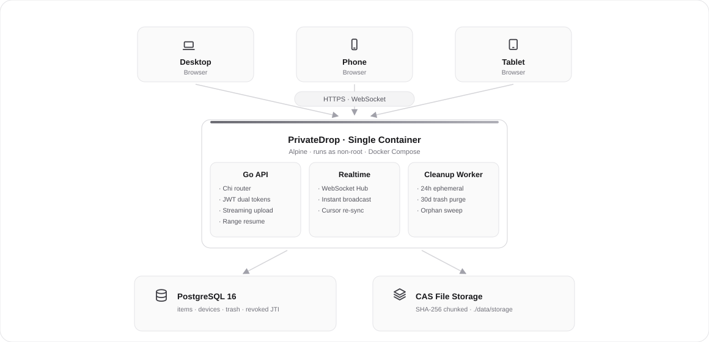

<div align="center">



[](https://github.com/teemosun/privatedrop/pkgs/container/privatedrop)
[](backend/)
[](frontend/)
[](https://www.postgresql.org/)
[](./LICENSE)

[简体中文](./README.md) | **English**

</div>

**PrivateDrop** is a self-hosted "instant drop + notes" space for your own server — think of it as a **self-hosted AirDrop / LocalSend alternative**: connect your computers, phones and tablets to one private space, drop a file or jot a note on any device, and it shows up **in real time** on all the others.

- 🔑 **Single-password login** — no sign-up flow, just log in and go
- 📁 **Files stay on your hardware** — no third parties involved, your data 100% under your control
- 🐳 **Single-container deployment** — up and running with one Docker Compose command

<br/>

## 🖼️ Preview

<div align="center">



</div>

An IM-style experience: messages in chronological order, an input bar pinned to the bottom, drag-and-drop from anywhere on desktop; adaptive dark / light themes with one consistent experience across desktop and mobile.

## ✨ Features

**🔄 Transfer & sync**

- IM-style chat layout: pending files stack compactly above the input bar, with upload progress and one-tap clear
- `Enter` to send, `Shift + Enter` for a new line — IME-aware, so confirming a candidate with Enter never sends by accident
- Real-time WebSocket push: new files / notes appear instantly on every online device; automatic reconnect with cursor-based incremental catch-up, so nothing is lost
- Streaming uploads, zero-copy downloads with HTTP Range resume support, and size + SHA-256 integrity verification

**📦 Storage efficiency**

- Content-addressed storage (CAS): files are chunked on disk by SHA-256 — identical files are deduplicated instantly and stored only once
- Reference-counted cleanup: disk space is only reclaimed after the last reference to a file is deleted

**🔒 Privacy & security**

- Dual JWT tokens: 15-minute access + 30-day rotating refresh, with per-device revocation
- Secret timeline: a hidden space opened by **long-pressing the "Timeline" button for 700ms**, fully isolated from the regular timeline and quick drop
- Automatic lifecycle management: quick-drop content is physically destroyed after 24 hours; deleted items stay in the trash for 30 days, restorable or permanently purgeable
- Hardening built in: CSP security headers, login rate limiting (5/min/IP, XFF-spoofing resistant), WS auth token never appears in URLs, containers run as a non-root user

**🌍 Ready out of the box**

- 17 UI languages (English, Chinese Simplified/Traditional, Japanese, Korean, German, French, Spanish, Russian…) with automatic browser detection
- Deep mobile adaptation: no layout jumps with the soft keyboard, strict viewport anchoring, full-format Android file picker support

### Pages

| Page | Route | Description |
|---|---|---|
| ⚡ Quick Drop | `/` | Default home for instant cross-device transfer; content auto-destroys after 24 hours |
| 📊 Timeline | `/timeline` | Permanent text notes and files |
| 🔒 Secret Timeline | `/secret` | Hidden private space, opened by long-pressing "Timeline" for 700ms |
| ⚙️ Manage | `/manage` | Device management (identify / rename / revoke) and trash (30-day restore / permanent delete) |

## 🚀 Quick Start

> Prerequisites: any machine that runs Docker — a NAS, a VPS, or a spare home computer.

### 1. Configure

```bash
git clone https://github.com/teemosun/privatedrop.git
cd privatedrop
cp .env.example .env
```

Edit `.env` and set the two required values (placeholder values are rejected at startup):

```dotenv
APP_PASSWORD=a-strong-login-password
JWT_SECRET=a-long-random-secret
```

### 2. Launch

```bash
docker compose up -d
```

The first start pulls the image, initializes the database and runs migrations automatically — no manual steps required.

### 3. Start using it

Open `http://<host-ip>:8000` in a browser and sign in with `APP_PASSWORD`. Point phones and tablets at the same address — they register as new devices on login and can be renamed or revoked under **Manage → Devices**.

> **💾 Data & backups**: everything lives in `./data/` on the host (`pgdata/` for the database + `storage/` for files). Back up that one directory and you're done; upgrading or recreating containers never touches your data.
>
> **🧰 Common operations**: `docker compose logs -f app` for logs; `docker compose down` to stop; pull a new image and `docker compose up -d` again to upgrade. To build from source instead: `docker build -t ghcr.io/teemosun/privatedrop:latest .`

## ⚙️ Environment Variables

| Variable | Required | Default | Description |
|---|---|---|---|
| `APP_PASSWORD` | ✅ | — | Login password (weak placeholder values are rejected) |
| `JWT_SECRET` | ✅ | — | JWT signing secret (long random string) |
| `POSTGRES_PASSWORD` | — | `privatedrop` | PostgreSQL password |
| `MAX_FILE_SIZE` | — | `5368709120` | Max size per file / item in bytes, 5 GiB by default |
| `UPLOAD_URL_TTL_SECONDS` | — | `900` | Lifetime of temporary download tickets (seconds) |

## 🏗️ Architecture & Tech Stack

<div align="center">



</div>

- **Frontend**: React 18 + Vite + TypeScript (strict mode) + Tailwind CSS, shadcn-style components
- **Backend**: Go 1.25 + Chi router, statically-compiled single binary, ~11 MB runtime memory footprint
- **Database**: PostgreSQL 16 with automatic idempotent schema migrations at startup
- **Realtime**: in-process WebSocket Hub + client pump broadcast, free of concurrent-write races
- **Background jobs**: a 10-minute cleanup loop (expired quick-drop items, 30-day trash purge, orphan chunks, stale JTIs)

## 📂 Project Structure

```text
privatedrop/
├── compose.yaml            # Production deployment: app + PostgreSQL 16
├── compose.dev.yaml        # Local development: sensible defaults, works out of the box
├── Dockerfile              # Multi-stage build: frontend assets + Go static binary → Alpine
├── .env.example            # Environment variable reference
├── docs/                   # Design docs & release workflows (Chinese)
├── scripts/                # Image publish / container entrypoint scripts
├── backend/                # Go backend
│   ├── cmd/server/         # Entrypoint: startup validation / health check / SPA hosting
│   ├── internal/           # api · config · database · security · storage · worker · ws
│   └── tests/              # Automated integration tests
└── frontend/               # React frontend
    └── src/                # pages · components · lib (api / i18n / utils)
```

## 🛠️ Local Development

```bash
# 1. Start PostgreSQL (bound to 127.0.0.1:5432 only)
docker compose -f compose.dev.yaml up -d db

# 2. Backend (Go >= 1.25; reads the root .env automatically — copy .env.example first)
cd backend && go run ./cmd/server        # listens on :8000

# 3. Frontend (separate terminal, Node 20+)
cd frontend && npm install && npm run dev   # http://localhost:5173, /api proxied to the backend
```

## 🧪 Testing

```bash
cd backend && go test -v -count=1 ./...   # Backend integration tests (uses the local dev database container)
cd frontend && npm run build              # Frontend type check + build
```

## 📦 Image Releases

Images are hosted on GitHub Container Registry and can be pulled directly:

```bash
docker pull ghcr.io/teemosun/privatedrop:latest
```

- Pushing to `main` or tagging a Release automatically triggers a GitHub Actions build and publish
- You can also build and push locally with `bash scripts/docker-push.sh`

## ❓ FAQ

<details>
<summary><b>How do I change the login password?</b></summary>

Edit `APP_PASSWORD` in `.env`, then restart with `docker compose up -d`. Startup validation rejects weak placeholders such as `admin` or `password`.
</details>

<details>
<summary><b>How do I back up data / migrate to a new machine?</b></summary>

Stop the services and copy the whole `data/` directory to the same location on the new machine — the database and all files live there. Then `docker compose up -d`.
</details>

<details>
<summary><b>Can I change the port?</b></summary>

Edit the app service's port mapping in `compose.yaml` (e.g. `"9000:8000"`) and restart the containers.
</details>

<details>
<summary><b>Is multi-user supported?</b></summary>

No. PrivateDrop is designed for personal / family use: a single password shares one data space, and every signed-in device can be revoked individually under **Manage → Devices**.
</details>

## 📚 More Documentation

- [Design document](docs/DESIGN.md) — architecture and implementation details (Chinese)
- [Device model mapping guide](docs/设备型号映射更新指南.md) (Chinese)
- [Docker image publishing](docs/Docker镜像打包上传.md) · [GitHub push workflow](docs/GitHub推送流程.md) (Chinese)

## 📄 License

This project is released under the [MIT License](./LICENSE) — free to use, modify and redistribute.

---

<div align="center">

If PrivateDrop is useful to you, a star is much appreciated ⭐

</div>
