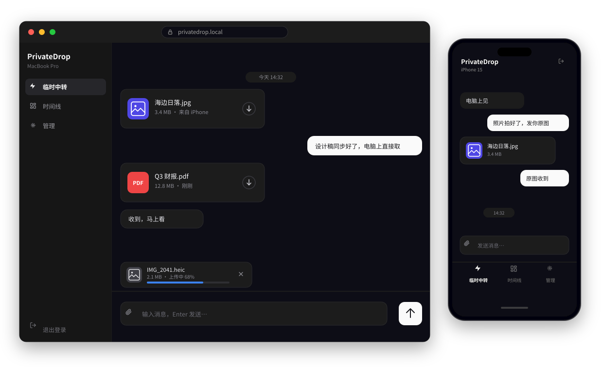

<div align="center">


[](https://github.com/teemosun/privatedrop/pkgs/container/privatedrop)
[](backend/)
[](frontend/)
[](https://www.postgresql.org/)

**简体中文** | [English](./README.en.md)

</div>

**PrivateDrop** 是一个部署在自己服务器上的「随身快传 + 笔记」空间，可以理解为 **自托管的 AirDrop / LocalSend 替代品**：把电脑、手机、平板连到同一个私密空间，任意设备拖入文件或随手记一条笔记，其他设备**实时同步、即点即下**。

- 🔑 **单密码登录**，无注册流程，登录即用
- 📁 **文件本地存储**，不经任何第三方，数据 100% 自控
- 🐳 **单容器部署**，Docker Compose 一条命令跑起来

<br/>

## 🖼️ 界面预览

<div align="center">



</div>

IM 式即时交互：消息流正序排列、输入框固定底部、桌面端任意位置拖入文件即可发送；深色 / 浅色主题自适应，桌面与移动端同一套体验。

## ✨ 核心特性

**🔄 传输与同步**

- IM 式聊天布局：待传文件紧凑排列在输入框上方，带上传进度条与一键清空
- `Enter` 发送、`Shift + Enter` 换行，自动识别输入法状态——拼音选词按回车不会误发送
- WebSocket 实时推送：新文件 / 笔记在所有在线设备即时出现；断线自动重连，并用游标增量补拉，不丢条目
- 文件流式上传、零拷贝下载，支持 HTTP Range 断点续传；上传带 size + SHA-256 双重完整性校验

**📦 存储效率**

- 内容寻址存储（CAS）：物理文件按 SHA-256 分片落盘，相同文件自动去重、秒传，只占一份磁盘
- 引用计数回收：同一文件被多处引用时，只有全部删除后才真正释放磁盘空间

**🔒 隐私与安全**

- JWT 双 token 认证：15 分钟 access + 30 天 refresh 轮换，支持按设备吊销登录
- 隐私时间线：**长按「时间线」按钮 700ms** 打开的隐藏私密空间，内容与常规时间线、临时中转完全隔离
- 生命周期自动管理：临时中转内容 24 小时后物理销毁并回收磁盘；删除内容进回收站保留 30 天，可恢复或彻底粉碎
- 多项内置加固：CSP 安全响应头、登录限流（5 次/分/IP，防 XFF 伪造）、WS 认证 token 不进 URL、容器以非 root 用户运行

**🌍 开箱即用**

- 界面内置 17 种语言（简繁中文、英、日、韩、德、法、西、俄等），跟随浏览器自动切换
- 移动端深度适配：软键盘弹出不错位、严格视口锚定、Android 系统文件选择器全格式支持

### 页面一览

| 页面 | 路由 | 说明 |
|---|---|---|
| ⚡ 临时中转 | `/` | 默认首页，跨设备快传；内容与文件 24 小时后自动销毁 |
| 📊 时间线 | `/timeline` | 永久保存的文本笔记与文件列表 |
| 🔒 隐私时间线 | `/secret` | 长按「时间线」700ms 打开的隐藏私密空间 |
| ⚙️ 管理 | `/manage` | 设备管理（识别 / 重命名 / 踢出设备）、回收站（30 天内恢复 / 彻底删除） |

## 🚀 快速开始

> 前置要求：一台能运行 Docker 的机器即可——NAS、VPS 或家里的闲置主机都行。

### 1. 准备配置

```bash
git clone https://github.com/teemosun/privatedrop.git
cd privatedrop
cp .env.example .env
```

编辑 `.env`，设置两个必填项（占位值会被启动校验直接拒绝）：

```dotenv
APP_PASSWORD=换成你的强登录密码
JWT_SECRET=换成随机长字符串
```

### 2. 一键启动

```bash
docker compose up -d
```

首次启动会自动拉取镜像、初始化数据库并执行迁移，无需其他手动步骤。

### 3. 开始使用

浏览器打开 `http://<主机IP>:8000`，输入 `APP_PASSWORD` 登录即可。手机、平板访问同一地址，登录后自动注册为新设备，可在「管理 → 设备管理」中重命名或踢出。

> **💾 数据与备份**：所有数据都落在宿主机 `./data/` 目录（`pgdata/` 数据库 + `storage/` 文件），直接备份这个目录即可完成整体备份；升级或重建容器不影响数据。
>
> **🧰 常用运维**：`docker compose logs -f app` 查看日志；`docker compose down` 停服；拉取新版镜像后重新 `docker compose up -d` 即完成升级。也可以从源码本地构建：`docker build -t ghcr.io/teemosun/privatedrop:latest .`

## ⚙️ 环境变量

| 变量 | 必填 | 默认值 | 说明 |
|---|---|---|---|
| `APP_PASSWORD` | ✅ | — | 登录密码（弱占位值会拒绝启动） |
| `JWT_SECRET` | ✅ | — | JWT 签名密钥（随机长字符串） |
| `POSTGRES_PASSWORD` | — | `privatedrop` | PostgreSQL 密码 |
| `MAX_FILE_SIZE` | — | `5368709120` | 单文件 / 条目大小上限（字节），默认 5 GiB |
| `UPLOAD_URL_TTL_SECONDS` | — | `900` | 临时下载票据有效期（秒） |

## 🏗️ 架构与技术栈

<div align="center">


</div>

- **前端**：React 18 + Vite + TypeScript（tsc 严格模式）+ Tailwind CSS，shadcn 风格组件
- **后端**：Go 1.25 + Chi 路由，静态编译单二进制，运行内存开销约 11 MB
- **数据库**：PostgreSQL 16，启动时自动执行幂等 Schema 迁移
- **实时通道**：进程内 WebSocket Hub + Client Pump 广播，无并发写竞态
- **后台任务**：10 分钟间隔定时清理（临时内容到期、回收站 30 天到期、孤儿碎片、过期 JTI）

## 📂 项目结构

```text
privatedrop/
├── compose.yaml            # 生产部署：app + PostgreSQL 16
├── compose.dev.yaml        # 本地开发：带默认值，开箱即用
├── Dockerfile              # 多阶段构建：前端产物 + Go 静态编译 → Alpine
├── .env.example            # 环境变量示例
├── docs/                   # 设计文档与发布流程
├── scripts/                # 镜像推送 / 容器入口脚本
├── backend/                # Go 后端
│   ├── cmd/server/         # 入口：启动校验 / 健康检查 / SPA 托管
│   ├── internal/           # api · config · database · security · storage · worker · ws
│   └── tests/              # 自动化集成测试
└── frontend/               # React 前端
    └── src/                # pages · components · lib（api / i18n / 工具）
```

## 🛠️ 本地开发

```bash
# 1. 启动 PostgreSQL（仅绑定 127.0.0.1:5432）
docker compose -f compose.dev.yaml up -d db

# 2. 后端（Go >= 1.25；配置自动读取根目录 .env，可复制 .env.example）
cd backend && go run ./cmd/server        # 监听 :8000

# 3. 前端（另开终端，Node 20+）
cd frontend && npm install && npm run dev   # http://localhost:5173，/api 代理到后端
```

## 🧪 测试

```bash
cd backend && go test -v -count=1 ./...   # 后端集成测试（依赖本地 dev 数据库容器）
cd frontend && npm run build              # 前端类型检查 + 构建
```

## 📦 镜像发布

镜像托管于 GitHub Container Registry，可直接拉取：

```bash
docker pull ghcr.io/teemosun/privatedrop:latest
```

- 推送到 `main` 分支或打 Release tag，会自动触发 GitHub Actions 构建并发布镜像
- 也可以本地执行 `bash scripts/docker-push.sh` 手动构建推送

## ❓ 常见问题

<details>
<summary><b>如何修改登录密码？</b></summary>

编辑 `.env` 中的 `APP_PASSWORD`，然后 `docker compose up -d` 重启生效。启动时会校验密码强度，`admin`、`password` 等弱占位值会直接拒绝启动。
</details>

<details>
<summary><b>如何备份数据 / 迁移到新机器？</b></summary>

停服后把 `data/` 目录整体打包复制到新机器的相同位置即可——数据库与全部文件都在里面。恢复后 `docker compose up -d` 启动。
</details>

<details>
<summary><b>想换一个端口？</b></summary>

修改 `compose.yaml` 中 app 服务的端口映射，例如 `"9000:8000"`，然后重启容器。
</details>

<details>
<summary><b>支持多用户吗？</b></summary>

不支持。PrivateDrop 定位为个人 / 家庭自用：单密码共享同一数据空间，所有已登录设备可在「管理 → 设备管理」中单独吊销。
</details>

## 📚 更多文档

- [设计文档](docs/DESIGN.md) —— 架构设计与关键实现细节
- [设备型号映射更新指南](docs/设备型号映射更新指南.md)
- [Docker 镜像打包上传](docs/Docker镜像打包上传.md) · [GitHub 推送流程](docs/GitHub推送流程.md)

---

<div align="center">

如果 PrivateDrop 对你有帮助，欢迎点个 Star ⭐

</div>
